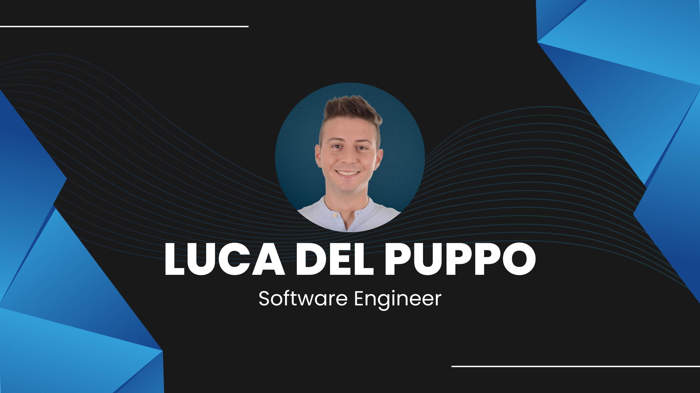

## Hi everybody! I'm Luca 👋 🏃 💻

I'm a software engineer and [Microsoft MVP](https://mvp.microsoft.com/it-it/PublicProfile/5005133). I love building beautiful, fast, responsive web applications.

I love to code in **Node.js**, **Javascript**, **TypeScript**, **Angular**, **React**, **C#** and sometimes I give talks about **Typescript**, **WebComponent**, **Node.js** and **Prisma**.

When I've some free minutes, I love to write articles on **[dev. to](https://dev.to/puppo)**

## 👨🏻‍💻 Programming Languages

  
  
  
  
  
  
  

## 💻 Framework and Libraries

  
  
  
  
  
  
  
  
  
  

## ☁️ Cloud Services

  
  
  
  

## 💾 Databases

  
  
  
  

## ⚙️ IDE & Editors

  

## 📝 Series posts

- [Playwright](https://dev.to/puppo/series/20832)
- [VsCode - Tips & Tricks](https://dev.to/puppo/series/16773)
- [It's Prisma Time](https://dev.to/puppo/series/15827)
- [RxJS - Getting Started](https://dev.to/puppo/series/13743)
- [Typescript - Tips & Tricks](https://dev.to/puppo/series/11213)

## 🗣️ My Contributions (speeches, articles, videos, etc.)

- [Contributions](https://github.com/puppo/public-speaking)

## 💌 Contact Me

